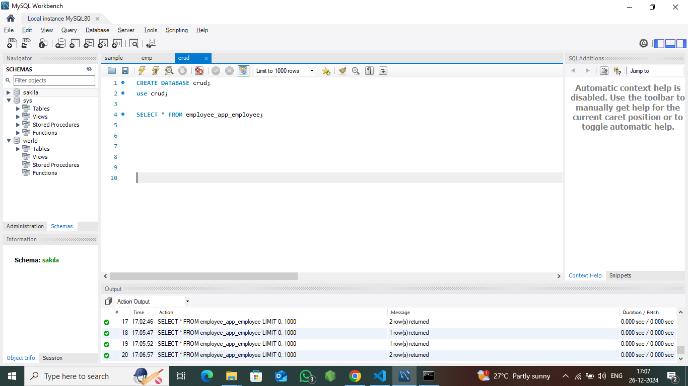
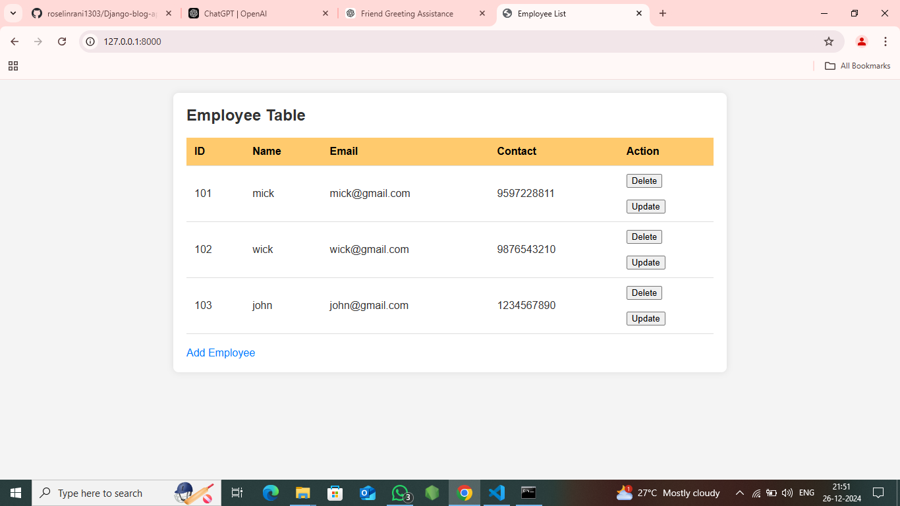
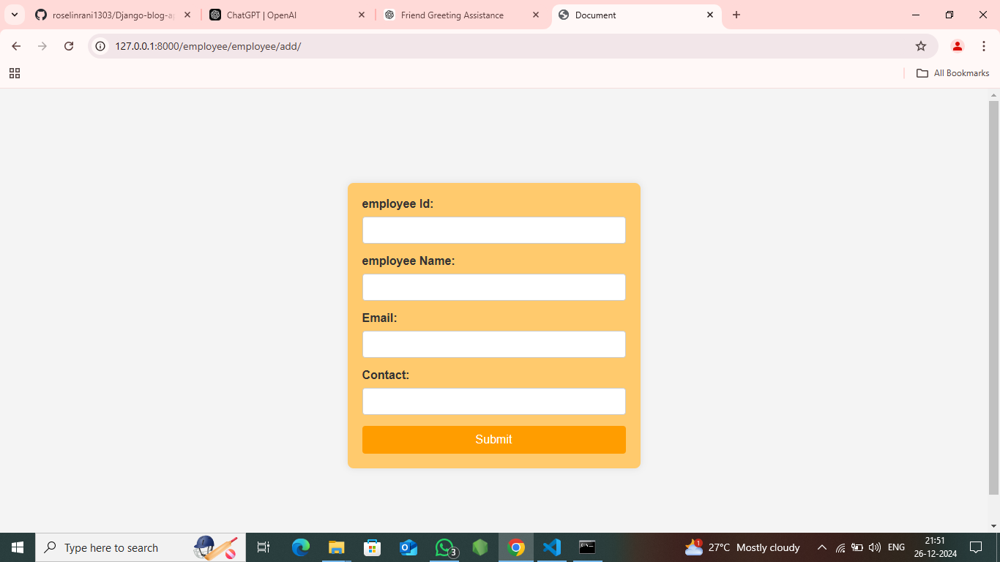
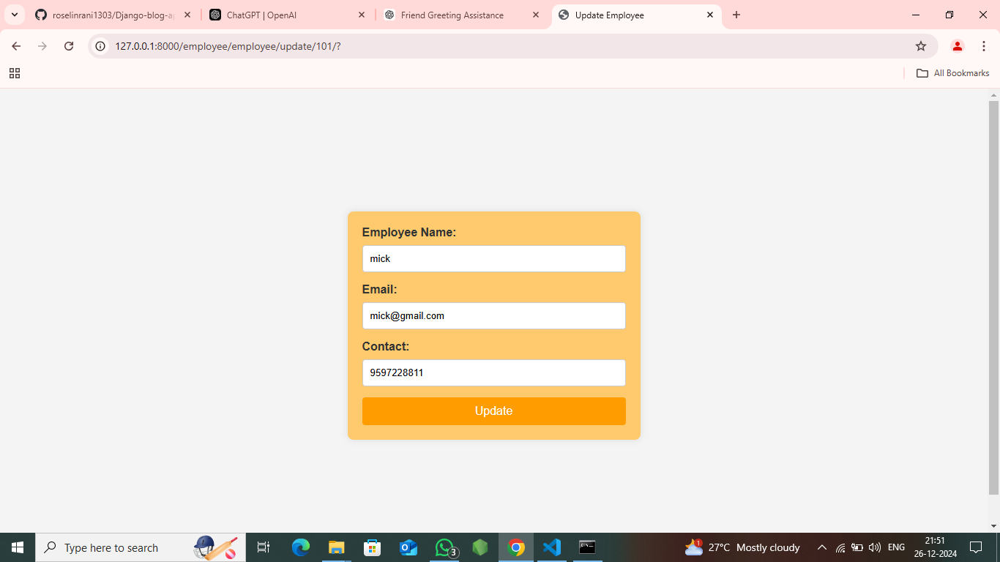

# Crud Method
## Overview
A simple blog application built with Django and Django Framework. It supports CRUD operations for posts and comments, pagination, and likes.

---

## Features
- Create, Read, Update, and Delete posts.
- Add comments to posts.
- Pagination for posts.
- Like and count likes for posts.

---

## Setup and Installation
### Prerequisites
- Python
- pip (Python package manager)
- Virtual environment tool (optional)

### Steps
1. Clone the repository:
   ```bash
   git clone https://github.com/Ashokkumar-debug/Django-crud-method.git
   ```
2. Move to the project folder:
   ```bash
   cd myproject
   ```
3. Install the requirements:
   ```bash
   pip install -r requirements.txt
   ```
4. Apply migrations:
   ```bash
   python manage.py migrate
   ```
5. Run the application:
   ```bash
   python manage.py runserver
   ```

---

## API Endpoints

### Posts
- **GET** — Get all posts:
  ```
  http://127.0.0.1:8000/posts
  ```
- **GET** — Get a post by ID:
  ```
  http://127.0.0.1:8000/posts/<id>
  ```
- **POST** — Add a new post:
  ```
  http://127.0.0.1:8000/posts
  ```
- **PUT** — Update an existing post:
  ```
  http://127.0.0.1:8000/posts/<id>
  ```
- **DELETE** — Delete a post:
  ```
  http://127.0.0.1:8000/posts/<id>
  ```

### Comments
- **GET** — Get all comments:
  ```
  http://127.0.0.1:8000/comments
  ```
- **POST** — Add a new comment:
  ```
  http://127.0.0.1:8000/comments
  ```

---

## Database
This application uses an SQL database for storing data related to posts, comments, and user information.

---

## Sample Output

### My SQL Workbench



### Employee Table



### Add Employee



### Employee Added


### Update Employee



### Delete Employee


---


